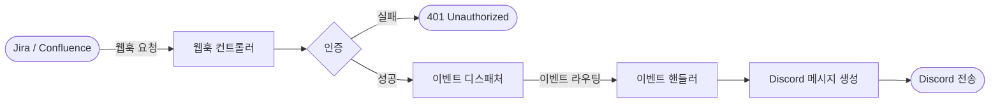

# ttalkkak-notify

Jira∙Confluence에서 보고되는 팀 내 의사결정과 작업 상태를, 딸깍 팀의 소통 플랫폼인 Discord로 실시간 전달합니다.

## 호출 흐름

```mermaid
flowchart LR
  A([Jira / Confluence]) -->|웹훅 요청| B[웹훅 컨트롤러]
  B --> C{인증}
  C -->|실패| D([401 Unauthorized])
  C -->|성공| E[이벤트 디스패처]
  E -->|이벤트 라우팅| F[이벤트 핸들러]
  F --> G[Discord 메시지 생성]
  G --> H([Discord 전송])
```

> Confluence 문서의 댓글 이벤트 핸들러는 댓글 본문 조회를 위해 Confluence REST API를 추가로 호출합니다.